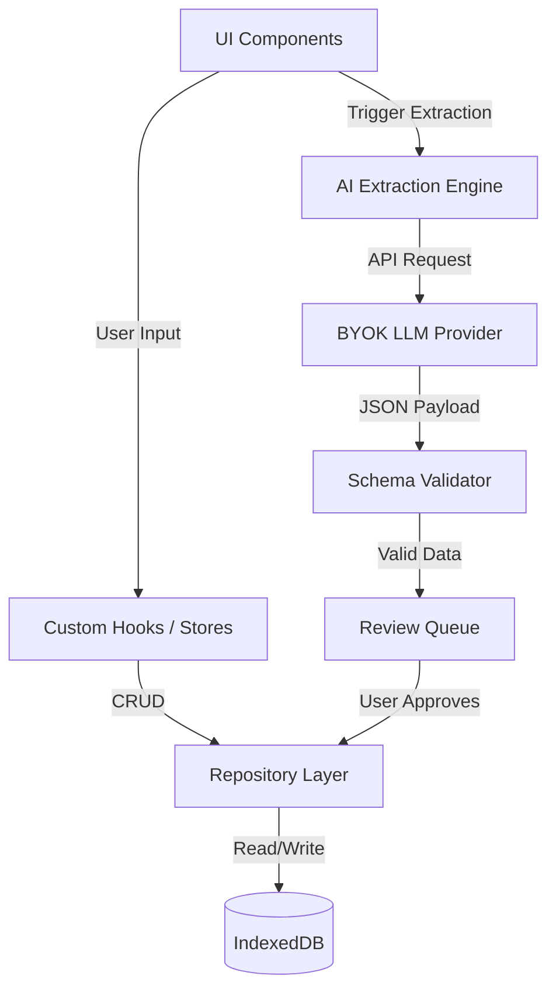

# Technical Architecture

NotterPad is architected as a modern, local-first web application. It leverages the Next.js App Router for structure, but heavily relies on client-side technologies to ensure offline functionality.

## System Layers

### 1. UI Layer
Built with React 19 and TailwindCSS. The UI is designed to be highly responsive and state-driven. Components are modular and separated by domain (Editor, Codex, Graph).

### 2. Custom Hooks & State Management
Business logic is decoupled from the UI using custom React hooks. 
- Global state (e.g., active chapter, UI theme) is managed via context or lightweight stores (like Zustand or Jotai).
- Transient state (e.g., Sprint active status) is managed by specialized stores (e.g., `sprintStore`).

### 3. Storage Layer (IndexedDBAdapter)
All persistent data lives in the browser's IndexedDB. We use an adapter pattern to abstract the underlying implementation (e.g., Dexie or localforage).
- **12 Object Stores:** The database is normalized into discrete stores: `chapters`, `characters`, `locations`, `items`, `organizations`, `relationships`, `events`, `abilities`, `dialogue_facts`, `settings`, `sprint_logs`, `review_queue`.

### 4. Repository Pattern (`repository.ts`)
To interact with the Storage Layer, we employ a Repository Pattern. This provides a clean, strongly-typed API for the rest of the application to perform CRUD operations, ensuring data integrity and simplifying testing.

### 5. AI Extraction Engine (`/api/analyze-chapter`)
While the app is primarily client-side, interaction with external AI providers is routed through Next.js serverless functions (or handled client-side for local models/CORS-enabled APIs).
- The engine constructs structured prompts instructing the LLM to return JSON.
- A **Validator** ensures the returned JSON matches the expected schema before it enters the Review Queue.

### 6. Canon/Consistency Engine (`/api/check-consistency`)
Similar to the extraction engine, this layer handles complex queries against the LLM, feeding it the manuscript text and relevant Story Bible facts to detect discrepancies.

## Data Flow Diagram

## Directory Structure & Responsibility Matrix

| Directory | Responsibility | Key Files / Patterns |
|-----------|----------------|----------------------|
| `/app` | Next.js routing, page composition. | `page.tsx`, `layout.tsx`, API routes. |
| `/components`| Reusable UI elements. | `Button.tsx`, `Editor.tsx`, `CodexView.tsx` |
| `/lib` | Core business logic, parsers, validators. | `schema-validators.ts`, `prompt-builder.ts` |
| `/hooks` | React hooks bridging UI and logic. | `useManuscript.ts`, `useCodex.ts` |
| `/store` | State management and DB interaction. | `repository.ts`, `IndexedDBAdapter.ts`, `sprintStore.ts` |
| `/types` | TypeScript interfaces and types. | `models.d.ts`, `api.d.ts` |

## Security & Privacy Considerations

- **API Keys:** API keys provided by the user are stored strictly in local storage or IndexedDB. They are never transmitted to NotterPad servers.
- **Data Export:** The architecture ensures that a complete snapshot of the IndexedDB can be serialized to JSON at any time, guaranteeing data portability.
